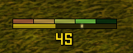

# SlyBars

## What is it

SlyBars is a lightweight and minimalistic energy and combopoint tracker addon for Wow WOTLK 3.3.5a.
This version is meant to be used on custom 3.3.5a servers that have energy ticks, such as Endless, Warmane's Onyxia or Project Epoch.
It features energy, compo point and energy tick tracking, autohiding when out of combat and poison reminders for rogues.

## How to install

Go to Releases in https://github.com/nullfoxh/SlyBars-WOTLK-custom/releases and download SlyBars.zip.  Extract it to your World of Warcraft/Interface/AddOns folder and you're done!
The final path should be: World of Warcraft/Interface/AddOns/SlyBars/SlyBars.toc.

## How to configure

Type `/sb` or `/slybars` in game access the config. The following commands are available:
* `config` - to enable config mode
* `xpos <number>` - To set the x position offset
* `ypos <number>` - To set the yx position offset
* `width <number>` - To set the frame width
* `comboheight <number>`- To set the combo point frame height
* `energyheight <number>` - To set the energy bar height
* `text` - To toggle the visbility of the energy text
* `fontsize <number>` - To set the size of the energy text
* `spark` - Toggle energy tick spark
* `smooth` - Toggle bar smoothing
* `fade` - Should frame fade out when no target exists
* `fadein <number>` - Frame fade in duration
* `fadeout <number>` - Frame fade out duration
* `reminder` To toggle poison reminders
* `ignoremh` - To toggle reminders for main hand poison
* `reset` - To reset all settings to default

While config-mode is enabled you may use the mousescroll wheel to configure the frame:
*Mousescroll up/down for horizontal position. Hold shift for vertical position.
*Hold control while scrolling to change the frame's width.
*Hold alt while scrolling to change energy bar's height.
*Hold control and alt while scrolling to change combopoint frame's height.

## Credits and acknowledgements
kuuff for their bugfix contributions
